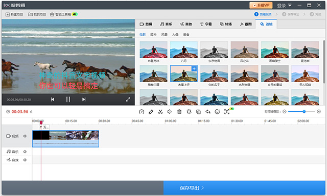

# kuaijianji.github.io
  <main class="container">
        <section class="screenshot">
            <!-- 替换实际截图链接 -->
            
        </section>

        

            

               
                <a href="https://pan.quark.cn/s/537e4318058f" class="download-btn quark">夸克网盘下载</a>
                <a href="https://ruanjian2025.pages.dev/" class="download-btn backup">防丢失备用链接</a>
            

